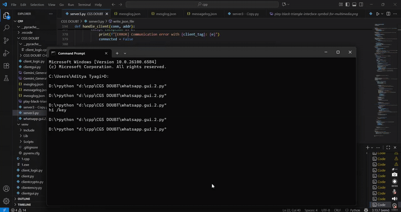

#Gapshape - Encrypted TCP Chat Application
    
This is a secure chat application with a full-featured and intuitive Graphical User Interface! built with the help of thinter. It is based on the principle of Hybrid cryptography to establish a secure connection between the 2 clients on the server.

Every client on the server is identified with a specific username. It has been made with the help of TCP Sockets in python. This application works on a CLIENT-SERVER Model in which multiple clients can connect to the server and can create a multi-client chat room where everyone can talk at once 🤝. Clients also can join chat rooms based on a specific topic so that they can find similar interested people there.

For this Threading in python has been used so that the server can handle multiple clients at the same time.





## Key Features →

 This guide will walk you through the main features of the chat application.

* 🫂   multi-threaded server to handle multiple clients.

*    ✅ Full-Featured GUI: Easily navigate servers, join rooms, and chat with friends through our user-friendly desktop client.

* 🚪 Instead of one global chat, it allows users to create or join different rooms (e.g., #common, #gaming, #work, #study). This lets users have department specific conversations. Initially there are added in a ‘common’ room but afterwards they can choose their room on their own. 
        
* 🛜 Clients can also apply their STATUS whether they are ONLINE, AWAY or want to be in DO NOT DISTURB mode so that nobody can send private message to disturb them. This clearly communicates your availability to others, which helps manage expectations and reduce unnecessary interruptions.

* ⏱️Accurate time stamps for messages on both the server as well as the client side.

* 📄 Message logging in 'messageslog.json' file.

* 🔒 end-to-end encrypted private messaging.

* 🗝️ Secure session key exchange using RSA.

* 💬 As the client joins any room, the client gets the opportunity to view at most 10 messages which were held on that particular room in his absence. 

* ⚙️ Cross-Platform: ** Runs on Windows, macOS, and Linux. 

Available Commands-
  
  * /privatemsg <recipent> <msg> - Undisclosed messaging service             for those who want to talk privately.
  * /list - To see the active users on the room and see their real time status.
  * /manual - to open the manual
  * /status <status_name>- to change your status
  * /knowrooms - to know the rooms in which the other clients      are in real time.
  * /quit - to disconnect from the server.

  ##Security model

   Cryptography in the program has been achieved with the help of both RSA (asymmetric) and AES (symmetric) cryptography (Hybrid cryptography).
Here RSA is used for key exchange to securely exchange the session key which provides Authentication AND Confidentiality for the secret key exchange.
   while AES is used for message encryption because it does very fast and efficient encryption of large amounts of data.
here is the example how it takes place-

Key Generation: Vinamra generates a random, single-use AES Session Key.

Key Encryption: Vinamra uses Arpit's Public Key (RSA) to encrypt the AES Session Key.

Key & Message Transmission: Vinamra sends two things to the server in a single packet addressed to Arpit:
a. The Encrypted AES Session Key.
b. The plaintext message, which is encrypted using the unencrypted AES Session Key.

Server Routing: The server forwards the package to Arpit.
Key Decryption: Arpit uses his Private Key (RSA) to decrypt the AES Session Key.

Message Decryption: Arpit uses the newly recovered AES Session Key to quickly decrypt the actual chat message.

   This ensures the plaintext message and the secret AES key are only ever exposed to Vinamra and Arpit. The server becomes completely blind to the content of the messages being sent. The server only sees the ciphertext.
All the conversations are also being stored in 'messglog.json file' with proper username and timestamps with the room in which the conversations were taking place. It also stores the time at which the user connected or disconnected the server which also tells us which clients joined the server.


   ##Builtwith-

       * Python
       * Tkinter
       * PyCryptodome
       * Socket
       * Threading 

     Installation and Setup-
Follow these steps to get the application running on your local machine:-

• Clone the repository: git clone [https://github.com/your-username/your-repo-name.git]

•  **Install the required packages: ** ```bash pip install -r requirements.txt ``` 

• ### Running the Application 

• You will need two separate terminals open.
        Start the server: In your first terminal, run the
        following command: ‘python server.py ‘
 
• Start the client: In your second terminal, run the GUI client: ```bash python clientgui.py ```.
   Now, simply enter a username in the application    
   Window to log in and start chatting!


